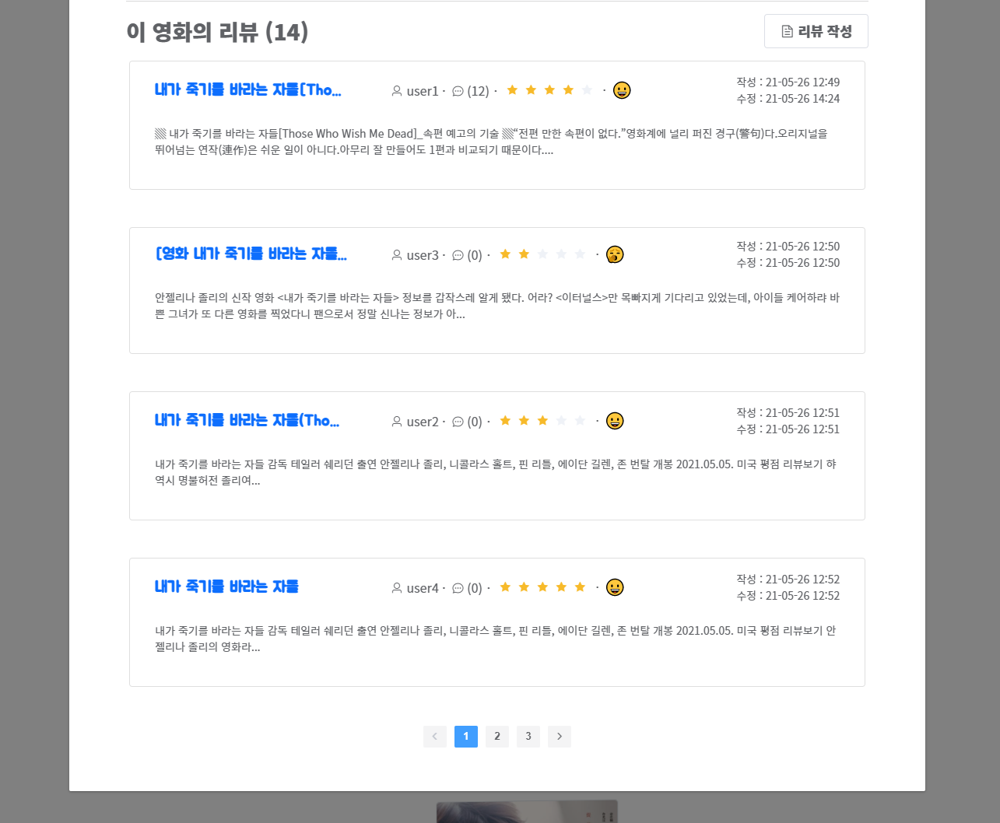

# Final_Project - 2021. 05. 20 ~ 2021. 05. 28

> 영화 정보 기반 추천 서비스 구성 
>
> 커뮤니티 서비스 구성 
>
> HTML, CSS, JavaScript, Vue.js, Django, REST API, DataBase 등을 활용한 실제 서비 스 설계 
>
> 서비스 관리 및 유지보수

 

---

 

### 팀원 정보 및 업무 분담 내역

 

- #### 팀원

  SSAFY 5기 서울 3반 __`안건우`__,__`안동준`__ 

   

- #### 업무 분담 내역

  Django Server & Vue component는 전부 같이 구성 및 코드 작성

  Vue Styling은 구역별로 나누어서 작업

 

---

 

### __MongCha__ 

`안건우` 님 께서 기르시는 강아지 이름은 __`"몽"`__ + 영화 스트리밍 사이트 __`"왓차"`__ 

 

=> 완성된 영화 추천 사이트의 이름은 __`"몽차"`__ 

 

---

 

### 목표 서비스 구현 및 실제 구현 정도

 

- #### 목표 서비스

  인기순 상위 10개의 영화 및 장르별 영화를 3D Carousel을 사용하여 사용자들에게 추천해주고 

  Instagram 처럼 리뷰에 태그를 다는 방식을 적용하고 이 정보를 바탕으로 사용자가 선택한 기분에 따라

  영화를 추천해주는 모델 및 알고리즘을 구성하려고 계획을 하였습니다. 

  그리고 Carousel Slide에 마우스를 올리면 애니메이션 효과와 함께 해당 영화에 대한 

  간단한 정보들을 사용자가 볼 수 있는 것을 목표로 하였습니다.

   

  마이-페이지 및 로그인 페이지를 따로 만들지 않고 Sidebar Component를 사용하여 접근할 수 있도록

  계획을 세웠습니다. 그리고 마이-페이지에서 내가 "좋아요"를 누른 영화들을 모으거나 사용자가 

  작성한 리뷰, 댓글을 손쉽게 조회, 수정, 삭제 할 수 있도록 서비스를 제공하려고 하였습니다.

 

- #### 서비스 구현 정도

  모든 영화 추천 Carousel에 3D Carousel을 사용하여 사용자가 페이지를 보는 동안 

  지루함을 덜 느끼도록 구현하였으며 인기순 상위 10개의 영화 및 장르별 영화를 

  추천해 주는 기능을 잘 구현하였습니다. 🤩

  Carousel Slide에 마우스를 올렸을 때 애니메이션 효과는 없지만 해당 영화의 제목, 장르, 개봉일을

  볼 수 있도록 서비스를 구현하였습니다.

   

  태그 기능의 경우, 처음에는 리뷰를 작성하는 사용자가 원하는 갯수 만큼, 원하는 내용으로 태그로 

  덧붙일 수 있는 기능을 제공하려고 계획했으나 그 기능은 전부 구현하지 못하였고

  대신 `#기쁨`, `#슬픔`, `#짜증`, `#심심`, `#사랑`, 이 5가지 태그 중 한개를 선택하여 

  리뷰를 작성하도록 만들었습니다. 그리고 이  5가지 태그를 기준으로 사용자가 선택한 태그와

  영화에 가장 많이 달린 태그가 일치하는 영화들을 추천해주는 기능을 구현하였습니다.

   

  Sidebar에 로그인 및 마이-페이지를 구현하였고, 사용자가 등록한 프로필 사진을 Sidebar 상단에 

  보여주는 기능을 계획했으나 그 부분은 구현하지 못하였습니다. 

  마이-페이지에서 사용자가 "좋아요"를 누른 영화 목록들을 Card 형태로 볼 수 있도록 만들었고,

  사용자가 작성한 리뷰 및 댓글을 모아 볼 수 있어 쉽게 조회, 수정, 삭제가 가능합니다.

  다만 이 3개의 페이지 모두 Pagination이 적용되지 않았고 갯수가 많아지게 되면 스크롤이 계속 밑으로

  늘어나는 불편함이 발생할 것으로 예상됩니다.

 

---

 

### ERD

 

---

 

### 필수 기능에 대한 설명

 

- #### 영화 정보

  50개 이상의 영화 데이터 베이스 구현(900여 개)

  

 

- #### 관리자 뷰 구현 ❌

 

- #### 전체 영화 페이지 구현

  - ##### 리스트

    인기순 top 10, 5개의 장르별(`로맨스`, `액션`, `판타지`, `공포`, `코메디`) 10개의 랜덤 영화의 포스터를 3D Carousel을 사용하여 출력

    시간이 지나면 자동으로 스크롤되는 3D Carousel 구현

    

   

  - ##### 포스터

    인기순 top 10 에서는 포스터의 왼쪽 하단에 순위 출력

    모든 포스터에 마우스 이동 시 영화의 간단한 상세정보(제목, 장르, 개봉날짜) 출력

    

     

    모든 포스터의 오른쪽 상단에 "좋아요" 여부에 따라 하트 아이콘 출력

    

    

 

- #### 상세 영화 페이지 구현

  해당 포스터를 클릭 시 Dialog의 형태로 영화의 상세정보 출력

  만약 DB에 poster_path 값이 존재하지 않는다면 default image 출력

  

   

  리뷰 데이터를 바탕으로 리뷰를 남긴 사용자들의 tag와 평점 평균 출력

  
  
   
  
  리뷰 리스트 출력 및 리뷰 작성을 버튼으로 구현, 리뷰 리스트 5개씩 Pagination
  
  

 

- #### 추천 영화 페이지 구현

  - ##### Tag

    리뷰 데이터를 바탕으로 리뷰를 작성한 사용자가 가장 많이 선택한 기분(tag)을 해당 영화의 기분(tag)으로 지정

    반응형 이모지를 활용하여 이모지 클릭 시, 해당 기분(tag)의 영화들을 3D Carousel을 사용하여 출력

    기분(tag)클릭 시 화면에 출력되는 "기분" Text의 색이 tag에 따라 변하도록 구현

    

 

- #### 커뮤니티

  - ##### 리뷰

    로그인한 사용자만 리뷰 조회 / 생성 및 작성자 본인만 글을 수정 / 삭제 기능 구현

    

     

    리뷰 작성 시 별점의 형태로 평점 기능 구현 (5점 만점)

    

     

    리뷰 정보에 해당 리뷰의 댓글 개수 출력

    

   

  - ##### 댓글

    게시글에 댓글 작성 및 수정 삭제 기능 구현

    

     

    모든 게시글 및 댓글에 생성 및 수정 시각 정보 포함

    Pagination을 활용, 페이지당 10개씩 댓글 출력

    

 

- #### 기타

  - __회원가입__

    간단한 Form으로 회원가입 구현

    

     

  - ##### SideBar

    Hamburger Button(☰) 클릭 시 오른쪽에서 SideBar 생성

    로그인 form 출력

    SideBar 하단에 현재 시간 정보를 보여주는 시계 출력

    

     

  - ##### 사용자 페이지

    로그인시 Sidebar에 마이-페이지 구현

    

     

    로그인한 사용자의 "좋아요"한 영화들을 Card 형태로 출력해주는 페이지 구현

    

     

    로그인한 사용자의 리뷰들을  Card 형태로 보여주는 페이지 구현

    

     

    로그인한 사용자의 댓글들을  Card 형태로 보여주는 페이지 구현

    

     

- 보안

  dotenv를 사용하여 API_KEY, Django SECRET_KEY 숨김

  

 

---

 

### 배포 서버 URL

배포 하지 못했습니다......😥

 

---

 

### 마치며....

 

#### __`안건우`__ 

교수님이 작년에 했던 프로젝트와 영상들을 보여줬을 땐 내가 할 수 있을까..? 겁이 많이 났었다.

때문에 처음에 어디서부터 시작해서 어떻게 코드를 짜야할지 갈피를 못잡았는데, 팀원(동준)이 순서대로 진행해야 할 코드를 잘 알려주고 이끌어줘서 이렇게 완성할 수 있었던 것 같다.

또 시간 남으면 추가 기능들을 구현해보자는 가벼운 마음으로 임했는데, 주말과 평일 저녁시간까지 프로젝트에 몰두하는 팀원(동준)을 보면서 나도 열심히 하자는 마음을 먹었다. 그래서 팀원(동준)에게 고마운 마음이 크다.

이렇게 완성된 프로젝트와 영상까지 제작하며 짧지만 길었던 일주일간의 기간이 뿌듯하고 자랑스럽다. 하지만 6개월간의 1학기가 끝나는 마지막 프로젝트로서는 아쉬운 마음도 든다. 

2학기도 열심히 임했던 1학기처럼 끝까지 열심히 임하자는 다짐으로 느낀점 끝:blush:

 

#### __`안동준`__

지난 1학기 동안 진행했던 관통 프로젝트의 경우 하루만에 프로젝트를 완성해야 했기에 미리 Skeleton Code가

주어졌고, 그 주에 학습한 내용을 복습하는 느낌으로 진행하면 됬었다.

하지만 이번 최종 프로젝트는 새하얀 도화지에서부터 시작하여 지난 1학기 동안 배운 내용을 모두 적용함과

동시에 개인적으로 더 추가할 부분을 직접 찾아서 생각하고 적용해보는 시간이 필요로 했다.

 

그냥 TMDb에서 영화 DB를 받아온다음에 인기순으로, 장르순으로 정렬하는데는 Model을 이미 저번에 했던

것을 그대로 가져오면 됬었지만, 새로운 추천 알고리즘을 적용하려다보니 Modeling도 조금 달라지고

serializer도 새롭게 작성해야 할 필요성을 느꼈다. 후에 Vue로 front 부분을 작업하다가 서버로부터 DB를 

받아오는데 작은 문제가 생겼던 적이 있는데, 모델간에 관계가 이리저리 얽혀 있어서 발생한 문제의 크기에 비해

Django에서 수정해야할 사항이 엄청나게 많아지더라..😑 

만약에 규모가 더 큰 웹을 개발한다고 생각하면 서버를 구축할 때 먼저 작성해야 하는 이 Modeling의 중요도가

더욱 클 것이라고 느꼈던 부분이다.

 

아무래도 Vue에서 axios 요청으로 전체 영화를 받아와 알고리즘대로 필터링을 하는 것보단, 애초에 

Django Server에서 ORM으로 DB에 있는 영화 QuerySet을 필터링하여 Vue로 보내주는 것이 더 효율적이기에

그런 방식으로 urls와 views를 작성하는 와중에..... 그냥 정렬이나 간단한 필터링 같은 경우에는 order_by라던지

filter를 사용하면 1~2줄 내로 views에서 함수가 작성되었는데, 알고리즘이 복잡해지고 모델도 직관적으로

작성을 하다보니 평소엔 잘 써보지 않았던 aggregate, annotate 까지 추가되고 annotate한 필드를 가지고

필터링을 하는 등 많이 복잡해져서 고민을 많이 했던 부분이다.

수업 시간 때 처음으로 SQL, ORM을 배울 때는 지금 생각해보면 깊게 배우지도 않고 되게 기본적인 부분만 배우고

실습을 해서 별 어려움을 느끼지 못했지만,  이게 조금만 복잡해지니까 굉장히 어려운 문제가 될 수도 있겠다는

것을 몸소 느꼈고 이 SQL, ORM에 대해 내가 아직 부족하고 좀 더 공부해야 할 필요성을 느꼈다.

 

Django Server 구축이 끝나고 Vue로 front 작업을 시작하는데, 생각보다 할 일이 꽤 많았다. Styling은 뒷전이고

일단 어떤 페이지를 router로 연결할지, 각 페이지마다 어떤 Component를 넣어야 되고, Component를 어떻게

구조화 할지 등 고려해야할 사항이 매우 많았다. Component가 많아지다보니 src/component에 들어갈 vue 

파일들도 잘 구조화하여 정리할 필요성을 느꼈다. 나중에 가보니 어떤 Component가 어떤 폴더에 들어가있는지

찾는데 애를 먹기도 하였다...

리뷰, 댓글 갯수가 많아졌을 때 페이지 스크롤이 계속 길어지는 것을 방지하기 위해 Pagination을 적용하려고

계획했다. 처음에는 이것도 DRF pagination으로 Django Server에서 처리를 하려고 했는데 마음처럼 잘 되지도

않고 Vue에서 보내는 axios 요청도 이것저것 고쳐야 하는 상황이 발생했다. 그래서 결국 Vue에서 전체 데이터를

slicing해서 pagination을 적용하였다.  이 프로젝트 작업하면서 자주 느낀건데 이 웹 안에서 서로간에 얽혀있는게

너무 많아서 이거 수정하면 저거 수정해야되고 저거 고치면 또 다른 무언가를 수정해야 하는 굴레에 빠져들게

되버린다.. 교수님들께서 자주 강조하시던 __유지, 보수__ 가 편리해야 한다는 그 말씀... 이제야 깨달았습니다... 😂

 

평소 부트스트랩의 flex로 정렬하는데 매우 편하고 익숙해져서 position이나 grid를 잘 사용하지 않았는데 또 이게

사용되어야 할 부분이 있는 것이었다... 역시 모든 기능에는 다 존재의 이유가 있는 것 같다... 편한 것만 골라서 

사용하다보면 언젠가 벽에 부딪히는 일이 발생함을 몸소 느꼈다. 편식을 하면 안되듯 공부하는데도 폭넓게 접근

하는 마음가짐을 가져야겠더라....

 

구글 웹폰트를 import 해와서 styling을 하는데 느꼈던 점이 두 가지가 있다. 첫번째로 styling에 있어서 폰트가

굉장한 영향력을 가졌다는 것이었다. 그냥 Arial 폰트를 사용했을 때는 뭔가 뼈대만 덩그러니 있는 느낌이었는데

폰트를 적용하니까 절반 이상은 완성됬다는 느낌을 받았다. 두 번째로 한글 폰트가 종류가 너무 적다... 구글 웹

폰트에 존재하는 한글 폰트 갯수도 부족해서 스타일링 하는데 어느 정도 한계가 발생하는 것 같았다. 물론 내가

구글 웹폰트 말고 다른 방법을 못 찾았던 것이겠지만 찾기 힘든만큼 상용화가 덜 되었다는게 아닐까 싶다.

 

일주일 동안 프로젝트를 진행하면서 참 많은 것을 느꼈고 또 배우기도 하였다. 지금 1학기 동안 배운 내용은 웹

개발자가 되기 위한 굉장히 기초였다고 생각한다. 얼마전에 SSAFY 학사 사이트에 칼럼 하나가 올라온 것을

대충 쓱 훑어봤는데 시스템이라는게 서로 이리저리 얽혀있어서  프론트엔드 직군이라고 백엔드에 필요한 

지식을 몰라도 되는 것이 아니고 그 반대도 마찬가지라더라... 가끔 웹 개발자로 취직하신 분들의 글을 보면

항상 부족하고 배워야 할게 많다고 느낀다라는 부분이 있는데 겸손이 아니라 현실을 얘기하고 있었던 것 같다.

앞으로 내가 공부해야 할 범위를 더 늘려가야 한다는 점인데.... 걱정도 많아지고 머리도 아파온다.....🤯

